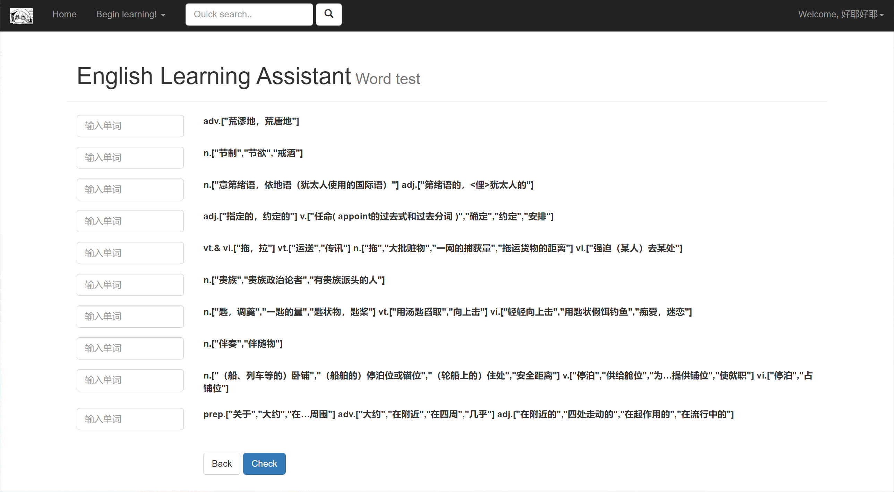

# JAVA_EnglishLearningAssistant
 javaweb/数据库课设/英语学习助手

---
title: 数据库课设-英语学习助手
date: 2022-06-05 11:04:59
tags: [sql,java]
---

javaweb/数据库课设/英语学习助手

本项目地址https://github.com/sterne012/en_learning_assistant/

blog地址https://sterne012.github.io/

html+javascript+jquery+boostrapv3+java+servlet+tomcat+beanutils+druid+jdbc+sql server=super 石山

音频资源（单词发音）来源百度翻译，图片来源网络、部分来自百词斩

结构显然不如spring框架等等，但是全手搓，感觉效果上还是不错的

似乎可能有一些小bug？

## 界面展示：

### 用户

有输入校验功能（写的有jquery有javascript，学的有点乱qwq）

#### 注册

#### home界面

上面的搜索框和词库中英文检索功能一致

复习即跳转熟词表

修改信息：

#### 词库

音频和图片只有部分有，比如aback，cat，dog，等等一点点

词库数据tb五块钱买的（）

底下做了分页

查询后词频也会增加

前面选中后点加入可以放进生词表，如果重复加入，会提示

#### 修改学习计划

保存修改后有相关反馈

#### 生词表界面

点rank的箭头可以更改排序，最大为10最小为0，超出范围调整会提示

点对号会把单词放到熟词表

如果熟练掌握数量到计划数，可以打卡

#### 打卡

咳咳，私货，左下角只是歌词而已

再学一会就是再来计划数的单词，修改计划在上面，退出就直接退出登录

#### 熟词表

有显示掌握的时间，点前面按钮可以放回生词表

#### 单词测试

通知只做了简单的alert

### 管理员

测试账户admin，1

#### 管理员信息简单修改

#### 数据库备份

备份到一个设定的路径

#### 管理单词表

按钮功能有所不同

#### 添加/修改/删除单词

也有相关校验（啊，标题忘了改），点保存即可保存

可以返回lib查看

勾选前面后可以修改

删除之后：

#### 用户表管理

#### 修改用户资料

也有相关校验

大概就这
